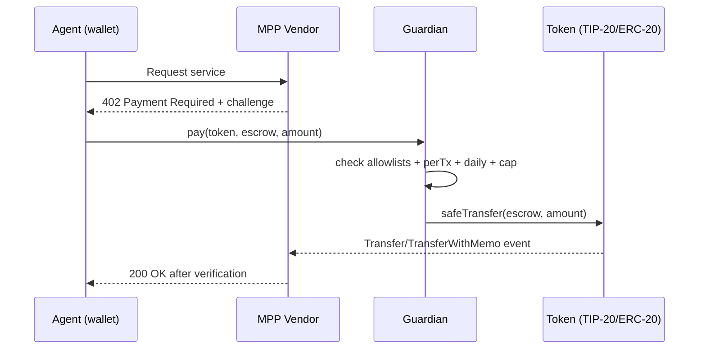

# Full Project Review of `suverenum/spire` on `feature/full-project-review`

## Executive summary

**Info needs (to answer this well):**
- Clarify the intended on‑chain policy semantics: should owner approvals override **only** per‑tx thresholds, or also daily/lifetime caps? This directly affects contract logic and PRD acceptance criteria. fileciteturn148file0L1-L1 fileciteturn154file0L1-L1  
- Confirm the operational environment for transactions on Tempo (fee token / sponsor / fee payer) and how it affects `msg.sender` and authorization (the web hook explicitly mentions a fee‑payer issue affecting `msg.sender`). fileciteturn162file0L1-L1  
- Confirm token compatibility requirements: stablecoin payments imply USDC/TIP‑20‑like tokens; for maximum safety you must handle ERC‑20 “optional return values” via `SafeERC20`. fileciteturn148file0L1-L1 citeturn0search2  
- Validate the MPP verification model: the README claims servers verify only `(token, recipient, amount)` from transfer events and not the initiator, which is a **major** protocol assumption and potential security risk unless properly bound to a challenge/invoice. fileciteturn148file0L1-L1  
- Decide upgrade strategy: immutable per‑agent contracts vs clones (ERC‑1167) vs proxies; this has major implications for auditability, incident response, and gas. fileciteturn155file0L1-L1 citeturn1search8  
- Establish key‑management policy for agent keys (generation, storage, one‑time export, encryption key rotation, breach response). Current server code encrypts with `SESSION_SECRET` and returns raw private key. fileciteturn163file0L1-L1 fileciteturn165file0L1-L1  

**Enabled connectors (explicit):** `github` (used first for repository extraction).

**Top findings (severity summarized):**
- **Critical:** hard‑coded private keys committed in demo scripts (`deploy-factory-v2.ts`, `fund-guardian.ts`). These must be treated as compromised and removed/rotated immediately. fileciteturn159file0L1-L1 fileciteturn160file0L1-L1  
- **High:** `SimpleGuardian` performs ERC‑20/TIP‑20 transfers via a custom `IERC20` interface and doesn’t use `SafeERC20`. This can break with tokens that return no value or return `false`, and can desync accounting vs actual transfers. fileciteturn154file0L1-L1 citeturn0search2  
- **High:** approvals currently bypass limits (`approvePay` has no cap checks; it updates `totalSpent` but not `spentToday`). This is inconsistent with “caps enforced by smart contracts” in README and can lead to under‑reporting daily spend. fileciteturn154file0L1-L1 fileciteturn148file0L1-L1  
- **High:** `apps/web/scripts/demo.ts` calls `GuardianFactory.createGuardian` using an **outdated ABI** (missing `recipients[]/tokens[]`), so the script cannot execute against the current on‑chain factory. fileciteturn161file0L1-L1 fileciteturn155file0L1-L1  
- **Medium:** CI does not run Foundry tests nor Slither; root workspaces exclude `contracts/` so contract tests/security scans are currently not enforced in CI. fileciteturn150file0L1-L1 fileciteturn151file0L1-L1  
- **Medium:** Next.js CSP includes `'unsafe-inline'` and `'unsafe-eval'`, which MDN explicitly warns against because it undermines CSP’s protection against XSS. fileciteturn169file0L1-L1 citeturn4search0  
- **Medium:** Session cookie uses a mutable name without `__Host-` prefix and `SameSite=lax`; OWASP recommends stricter cookie attributes/prefixing for session cookies when feasible. fileciteturn166file0L1-L1 citeturn5search0  

Assumptions required by the prompt:
- **Target networks:** not specified (recommendations provided for Ethereum mainnet, L2s, and testnets; repo itself references Tempo mainnet/testnet). fileciteturn148file0L1-L1  
- **Time/budget:** not specified (kept as “not specified” in backlog).

## Inventory of artifacts retrieved from the specified branch

### Retrieved via GitHub connector and analyzed

> Tooling limitation: the GitHub connector in this environment did **not** provide a reliable “recursive repo tree listing” API. Therefore, the inventory below is the **complete set of files successfully retrieved** from `feature/full-project-review` during this run. Anything outside this list is “not retrieved / not analyzed”, and the backlog includes a “full repo inventory” task.

| Path | Type | Status |
|---|---|---|
| `README.md` fileciteturn148file0L1-L1 | docs | analyzed |
| `.github/workflows/ci.yml` fileciteturn150file0L1-L1 | CI | analyzed |
| `package.json` fileciteturn151file0L1-L1 | build config | analyzed |
| `apps/web/package.json` fileciteturn152file0L1-L1 | app config | analyzed |
| `apps/web/next.config.ts` fileciteturn169file0L1-L1 | app config | analyzed |
| `apps/web/src/lib/env.ts` fileciteturn168file0L1-L1 | env | analyzed |
| `apps/web/src/lib/constants.ts` fileciteturn167file0L1-L1 | constants | analyzed |
| `apps/web/src/lib/session.ts` fileciteturn166file0L1-L1 | session/auth | analyzed |
| `apps/web/src/lib/crypto.ts` fileciteturn165file0L1-L1 | crypto | analyzed |
| `apps/web/src/domain/agents/hooks/use-deploy-guardian.ts` fileciteturn162file0L1-L1 | on‑chain integration | analyzed |
| `apps/web/src/domain/agents/actions/create-agent-wallet.ts` fileciteturn163file0L1-L1 | server action | analyzed |
| `apps/web/src/domain/agents/actions/create-agent-wallet.test.ts` fileciteturn164file0L1-L1 | unit test | analyzed |
| `apps/web/scripts/deploy-factory-mainnet.ts` fileciteturn158file0L1-L1 | deploy script | analyzed |
| `apps/web/scripts/demo/deploy-factory-v2.ts` fileciteturn159file0L1-L1 | demo deploy | analyzed |
| `apps/web/scripts/demo/fund-guardian.ts` fileciteturn160file0L1-L1 | demo funding | analyzed |
| `apps/web/scripts/demo.ts` fileciteturn161file0L1-L1 | demo | analyzed |
| `contracts/foundry.toml` fileciteturn153file0L1-L1 | Foundry config | analyzed |
| `contracts/src/SimpleGuardian.sol` fileciteturn154file0L1-L1 | smart contract | analyzed |
| `contracts/src/GuardianFactory.sol` fileciteturn155file0L1-L1 | smart contract | analyzed |
| `contracts/test/unit/GuardianFactory.t.sol` fileciteturn156file0L1-L1 | Foundry tests | analyzed |
| `contracts/test/helpers/MockERC20.sol` fileciteturn157file0L1-L1 | test helper | analyzed |

### Not retrieved / not analyzed

Because a full recursive tree could not be obtained through the connector, all other repository artifacts are treated as **not retrieved / not analyzed**, and an explicit backlog task “full repo inventory” is included below.

## Full code review with issues and concrete patches

### Issues table

Each row includes: file/path, approximate location (function and approximate lines), severity, explanation, and a concrete patch reference (diff fragments are provided immediately after the table).

| ID | Area | File / location | Severity | What’s wrong | Concrete fix |
|---|---|---|---|---|---|
| SC‑001 | Contracts | `contracts/src/SimpleGuardian.sol` / `withdraw`, `pay`, `proposePay`, `approvePay` (≈ lines 90–190) fileciteturn154file0L1-L1 | **High** | Transfers use `IERC20.transfer` with a custom interface; no `SafeERC20`. Tokens that return no value or return `false` can break assumptions and desync accounting. | Patch **D‑SG‑HARDEN** (SafeERC20 + errors + events) |
| SC‑002 | Contracts | `SimpleGuardian.approvePay` (≈ lines 165–185) fileciteturn154file0L1-L1 | **High** | `approvePay` bypasses all limits (no daily/cap checks), and updates `totalSpent` but not `spentToday`, so daily spend can be under‑reported. | Patch **D‑SG‑HARDEN** (approval enforces caps + consistent accounting) |
| SC‑003 | Contracts | `SimpleGuardian.constructor`, `addRecipient/addToken` (≈ lines 40–80) fileciteturn154file0L1-L1 | Medium | Zero address checks are missing for `_owner`, `_agent`, recipients, tokens; additions have no events (removals do). | Patch **D‑SG‑HARDEN** (zero checks + RecipientAdded/TokenAdded) |
| SC‑004 | Contracts | `SimpleGuardian.updateLimits` (≈ lines 85–92) fileciteturn154file0L1-L1 | Medium | Updates only `maxPerTx` and `dailyLimit` but not `spendingCap`; no invariant validation (`maxPerTx ≤ daily ≤ cap`). | Patch **D‑SG‑HARDEN** (update all + validate invariants) |
| SC‑005 | Contracts | `SimpleGuardian` overall fileciteturn154file0L1-L1 | Medium | No pause/circuit breaker; no agent key rotation; unlimited proposal growth (storage bloat / griefing by agent). | Patch **D‑SG‑HARDEN** (pause, agent rotation, pending cap) |
| SC‑006 | Contracts | `GuardianFactory.createGuardian` (≈ lines 15–35) fileciteturn155file0L1-L1 | Medium | No input validation (`agent==0`, arrays too large, zero addresses in allowlists). Can create “bricked” guardian or gas bombs. | Patch **D‑GF‑VALIDATE** |
| SC‑007 | Contracts | `GuardianFactory.getGuardianAddress` (≈ lines 36–70) fileciteturn155file0L1-L1 | Low | Correctly uses `address(this)` in CREATE2 address derivation; doc clarity needed because many confuse “sender” in formula. | Add documentation + cite EIP‑1014 citeturn1search6 |
| TEST‑001 | Tests | `contracts/test/helpers/MockERC20.sol` fileciteturn157file0L1-L1 | Medium | Mock token always returns `true` and reverts on insufficiency; missing mocks for `false` return and “no return value”. | Patch **D‑TEST‑MOCKS** |
| TEST‑002 | Tests | `contracts/test/unit/GuardianFactory.t.sol` (approval tests) fileciteturn156file0L1-L1 | Medium | Tests don’t verify approval semantics vs daily/cap, and don’t cover “over daily/cap propose” cases. | Patch **D‑TEST‑SEMANTICS** |
| CI‑001 | CI | `.github/workflows/ci.yml` fileciteturn150file0L1-L1 and `package.json` fileciteturn151file0L1-L1 | **High** | Contracts aren’t tested in CI (no `forge test`, no Slither). Root workspaces exclude `contracts/`, so Turbo won’t cover it. | Patch **D‑CI‑CONTRACTS** using Foundry action citeturn2search0 and Slither docs citeturn0search3 |
| OPS‑001 | Deploy/Demo | `apps/web/scripts/demo/deploy-factory-v2.ts` (≈ line 7) fileciteturn159file0L1-L1 | **Critical** | Hard‑coded private key committed. Must treat it as compromised. | Patch **D‑OPS‑SECRETS** |
| OPS‑002 | Deploy/Demo | `apps/web/scripts/demo/fund-guardian.ts` (≈ line 6) fileciteturn160file0L1-L1 | **Critical** | Hard‑coded agent private key; hard‑coded token + guardian addresses. | Patch **D‑OPS‑SECRETS** |
| OPS‑003 | Deploy | `apps/web/scripts/deploy-factory-mainnet.ts` (≈ line 40+) fileciteturn158file0L1-L1 | High | Absolute local artifact path; non‑reproducible for CI/team. | Patch **D‑OPS‑ARTIFACTS** |
| OPS‑004 | Demo | `apps/web/scripts/demo.ts` (GuardianFactory ABI) fileciteturn161file0L1-L1 | High | Calls `createGuardian` with outdated signature (missing `recipients[]/tokens[]`), so demo breaks and misleads. | Patch **D‑OPS‑DEMO‑ABI** |
| WEB‑001 | Web/on‑chain integration | `use-deploy-guardian.ts` fileciteturn162file0L1-L1 | Medium | Explicit comment: separate allowlist txs can revert due to fee‑payer `msg.sender` differences; this threatens any owner‑only admin calls. | Architecture fix: meta‑tx support or all critical config in constructor; add owner ops strategy |
| WEB‑002 | Web/key mgmt | `create-agent-wallet.ts` returns raw private key fileciteturn163file0L1-L1 | Medium | Comment says “returns ONCE”, but code returns raw key whenever called with valid session; no “one-time export” enforcement. | Patch + DB flag in backlog (or ephemeral export token) |
| WEB‑003 | Web/crypto | `apps/web/src/lib/crypto.ts` fileciteturn165file0L1-L1 | Medium | Uses `SESSION_SECRET` for encrypting agent keys. Secret purpose mixing complicates rotation and blast radius. | Patch **D‑WEB‑CRYPTO‑SECRET** (use `ENCRYPTION_SECRET`, versioning) |
| WEB‑004 | Web/session | `apps/web/src/lib/session.ts` + `constants.ts` fileciteturn166file0L1-L1 fileciteturn167file0L1-L1 | Medium | Dev fallback secret; cookie is `SameSite=lax`, name lacks `__Host-` prefix. OWASP recommends stricter prefixes/attrs where feasible. citeturn5search0 | Patch **D‑WEB‑SESSION** |
| SEC‑MPP‑001 | Protocol assumption | `README.md` MPP section fileciteturn148file0L1-L1 | **High** | README states MPP server verifies only (token, recipient, amount) and not initiator—this can enable payment attribution spoofing unless challenge binding exists. | Architecture+PRD: require memo/challenge binding; Tempo has transfer memos for reconciliation citeturn6search3turn6search4 |

### Diff fragments

#### Diff fragment D‑SG‑HARDEN — Harden `SimpleGuardian.sol`

This patch: SafeERC20, custom errors, invariant checks, `pause/unpause`, `setAgent`, consistent accounting, events for allowlist additions, and approval semantics that allow bypassing only the per‑tx threshold (while still respecting daily/cap), aligning to README’s “caps enforced by smart contracts.” fileciteturn148file0L1-L1  
It uses OpenZeppelin `SafeERC20`, which explicitly supports tokens that return `false` or return no value. citeturn0search2

```diff
diff --git a/contracts/src/SimpleGuardian.sol b/contracts/src/SimpleGuardian.sol
--- a/contracts/src/SimpleGuardian.sol
+++ b/contracts/src/SimpleGuardian.sol
@@
 // SPDX-License-Identifier: MIT
 pragma solidity ^0.8.24;

+import {IERC20} from "@openzeppelin/contracts/token/ERC20/IERC20.sol";
+import {SafeERC20} from "@openzeppelin/contracts/token/ERC20/utils/SafeERC20.sol";
+
 /// @title SimpleGuardian
 /// @notice On-chain spending guardrails for AI agents with owner approval flow.
@@
-interface IERC20 {
-    function transfer(address to, uint256 amount) external returns (bool);
-    function balanceOf(address account) external view returns (uint256);
-}
-
 contract SimpleGuardian {
-    address public immutable owner;
-    address public immutable agent;
+    using SafeERC20 for IERC20;
+
+    // cheaper than revert strings
+    error NotAgent();
+    error NotOwner();
+    error ZeroAddress();
+    error TokenNotAllowed(address token);
+    error RecipientNotAllowed(address recipient);
+    error ExceedsPerTxLimit(uint256 amount, uint256 maxPerTx);
+    error DailyLimitExceeded(uint256 newSpentToday, uint256 dailyLimit);
+    error SpendingCapExceeded(uint256 newTotalSpent, uint256 spendingCap);
+    error NotPending(uint256 id);
+    error InvalidProposal(uint256 id);
+    error Paused();
+    error LimitsInvariantViolation();
+    error PendingQueueFull(uint256 maxPending);
+
+    address public owner;
+    address public agent;
+    address public pendingOwner;
@@
     uint256 public maxPerTx;
     uint256 public dailyLimit;
     uint256 public spendingCap;
@@
     mapping(address => bool) public allowedRecipients;
     mapping(address => bool) public allowedTokens;
+
+    bool public paused;
@@
     struct Proposal {
         address token;
         address to;
         uint256 amount;
         uint8 status; // 0 = pending, 1 = approved, 2 = rejected
         uint256 createdAt;
     }
@@
     uint256 public proposalCount;
     mapping(uint256 => Proposal) public proposals;
+    uint256 public pendingCount;
+    uint256 public constant MAX_PENDING = 32;
@@
     event PaymentExecuted(address indexed token, address indexed to, uint256 amount);
@@
-    event LimitsUpdated(uint256 maxPerTx, uint256 dailyLimit);
+    event LimitsUpdated(uint256 maxPerTx, uint256 dailyLimit, uint256 spendingCap);
+    event RecipientAdded(address indexed recipient);
+    event TokenAdded(address indexed token);
+    event PausedStateChanged(bool paused);
+    event AgentUpdated(address indexed oldAgent, address indexed newAgent);
+    event OwnershipTransferStarted(address indexed oldOwner, address indexed newOwner);
+    event OwnershipTransferred(address indexed oldOwner, address indexed newOwner);
@@
     modifier onlyAgent() {
-        require(msg.sender == agent, "Not agent");
+        if (msg.sender != agent) revert NotAgent();
         _;
     }
 
     modifier onlyOwner() {
-        require(msg.sender == owner, "Not owner");
+        if (msg.sender != owner) revert NotOwner();
         _;
     }
+
+    modifier whenNotPaused() {
+        if (paused) revert Paused();
+        _;
+    }
@@
     constructor(
         address _owner,
         address _agent,
         uint256 _maxPerTx,
         uint256 _dailyLimit,
         uint256 _spendingCap,
         address[] memory _recipients,
         address[] memory _tokens
     ) {
-        owner = _owner;
-        agent = _agent;
+        if (_owner == address(0) || _agent == address(0)) revert ZeroAddress();
+        _validateLimits(_maxPerTx, _dailyLimit, _spendingCap);
+        owner = _owner;
+        agent = _agent;
         maxPerTx = _maxPerTx;
         dailyLimit = _dailyLimit;
         spendingCap = _spendingCap;
         lastResetDay = block.timestamp / 1 days;
         for (uint256 i = 0; i < _recipients.length; i++) {
-            allowedRecipients[_recipients[i]] = true;
+            address r = _recipients[i];
+            if (r == address(0)) revert ZeroAddress();
+            allowedRecipients[r] = true;
+            emit RecipientAdded(r);
         }
         for (uint256 i = 0; i < _tokens.length; i++) {
-            allowedTokens[_tokens[i]] = true;
+            address t = _tokens[i];
+            if (t == address(0)) revert ZeroAddress();
+            allowedTokens[t] = true;
+            emit TokenAdded(t);
         }
     }
 
     function addRecipient(address r) external onlyOwner {
+        if (r == address(0)) revert ZeroAddress();
         allowedRecipients[r] = true;
+        emit RecipientAdded(r);
     }
 
     function addToken(address t) external onlyOwner {
+        if (t == address(0)) revert ZeroAddress();
         allowedTokens[t] = true;
+        emit TokenAdded(t);
     }
@@
-    function updateLimits(uint256 _maxPerTx, uint256 _dailyLimit) external onlyOwner {
+    function updateLimits(uint256 _maxPerTx, uint256 _dailyLimit, uint256 _spendingCap) external onlyOwner {
+        _validateLimits(_maxPerTx, _dailyLimit, _spendingCap);
         maxPerTx = _maxPerTx;
         dailyLimit = _dailyLimit;
-        emit LimitsUpdated(_maxPerTx, _dailyLimit);
+        spendingCap = _spendingCap;
+        emit LimitsUpdated(_maxPerTx, _dailyLimit, _spendingCap);
     }
+
+    function pause() external onlyOwner { paused = true; emit PausedStateChanged(true); }
+    function unpause() external onlyOwner { paused = false; emit PausedStateChanged(false); }
+
+    function setAgent(address newAgent) external onlyOwner {
+        if (newAgent == address(0)) revert ZeroAddress();
+        address old = agent;
+        agent = newAgent;
+        emit AgentUpdated(old, newAgent);
+    }
+
+    function transferOwnership(address newOwner) external onlyOwner {
+        if (newOwner == address(0)) revert ZeroAddress();
+        pendingOwner = newOwner;
+        emit OwnershipTransferStarted(owner, newOwner);
+    }
+
+    function acceptOwnership() external {
+        if (msg.sender != pendingOwner) revert NotOwner();
+        address old = owner;
+        owner = pendingOwner;
+        pendingOwner = address(0);
+        emit OwnershipTransferred(old, owner);
+    }
@@
     function withdraw(address token) external onlyOwner {
-        uint256 balance = IERC20(token).balanceOf(address(this));
-        require(balance > 0, "No balance");
-        IERC20(token).transfer(owner, balance);
+        uint256 balance = IERC20(token).balanceOf(address(this));
+        if (balance == 0) revert();
+        IERC20(token).safeTransfer(owner, balance);
         emit Withdrawn(token, balance);
     }
@@
-    function pay(address token, address to, uint256 amount) external onlyAgent {
-        require(allowedTokens[token], "Token not allowed");
-        require(allowedRecipients[to], "Recipient not allowed");
-        require(amount <= maxPerTx, "Exceeds per-tx limit");
+    function pay(address token, address to, uint256 amount) external onlyAgent whenNotPaused {
+        if (!allowedTokens[token]) revert TokenNotAllowed(token);
+        if (!allowedRecipients[to]) revert RecipientNotAllowed(to);
+        if (amount > maxPerTx) revert ExceedsPerTxLimit(amount, maxPerTx);
 
         uint256 today = block.timestamp / 1 days;
         if (today > lastResetDay) {
             spentToday = 0;
             lastResetDay = today;
         }
-        require(spentToday + amount <= dailyLimit, "Daily limit exceeded");
-        require(spendingCap == 0 || totalSpent + amount <= spendingCap, "Spending cap exceeded");
+        _enforceDailyAndCap(amount);
 
         spentToday += amount;
         totalSpent += amount;
-        IERC20(token).transfer(to, amount);
+        IERC20(token).safeTransfer(to, amount);
         emit PaymentExecuted(token, to, amount);
     }
@@
     function proposePay(address token, address to, uint256 amount)
         external
         onlyAgent
+        whenNotPaused
         returns (uint256 proposalId, bool executed)
     {
-        require(allowedTokens[token], "Token not allowed");
-        require(allowedRecipients[to], "Recipient not allowed");
+        if (!allowedTokens[token]) revert TokenNotAllowed(token);
+        if (!allowedRecipients[to]) revert RecipientNotAllowed(to);
 
         uint256 today = block.timestamp / 1 days;
         if (today > lastResetDay) {
             spentToday = 0;
             lastResetDay = today;
         }
 
-        bool withinLimits = amount <= maxPerTx
-            && spentToday + amount <= dailyLimit
-            && (spendingCap == 0 || totalSpent + amount <= spendingCap);
+        // execute immediately if within per-tx; still respects daily/cap
+        if (amount <= maxPerTx) {
+            _enforceDailyAndCap(amount);
+            spentToday += amount;
+            totalSpent += amount;
+            IERC20(token).safeTransfer(to, amount);
+            emit PaymentExecuted(token, to, amount);
+            return (0, true);
+        }
 
-        if (withinLimits) {
-            spentToday += amount;
-            totalSpent += amount;
-            IERC20(token).transfer(to, amount);
-            emit PaymentExecuted(token, to, amount);
-            return (0, true);
-        }
+        // above per-tx threshold -> proposal, but only if it can still fit daily/cap
+        _enforceDailyAndCap(amount);
+        if (pendingCount >= MAX_PENDING) revert PendingQueueFull(MAX_PENDING);
 
         proposalCount++;
+        pendingCount++;
         proposals[proposalCount] = Proposal({
             token: token,
             to: to,
             amount: amount,
             status: 0,
             createdAt: block.timestamp
         });
@@
-    function approvePay(uint256 proposalId) external onlyOwner {
+    function approvePay(uint256 proposalId) external onlyOwner whenNotPaused {
         Proposal storage p = proposals[proposalId];
-        require(p.status == 0, "Not pending");
-        require(p.amount > 0, "Invalid proposal");
+        if (proposalId == 0 || p.amount == 0) revert InvalidProposal(proposalId);
+        if (p.status != 0) revert NotPending(proposalId);
 
+        uint256 today = block.timestamp / 1 days;
+        if (today > lastResetDay) { spentToday = 0; lastResetDay = today; }
+        _enforceDailyAndCap(p.amount);
+
         p.status = 1;
+        pendingCount--;
+        spentToday += p.amount;
         totalSpent += p.amount;
-        IERC20(p.token).transfer(p.to, p.amount);
+        IERC20(p.token).safeTransfer(p.to, p.amount);
         emit PaymentApproved(proposalId, p.token, p.to, p.amount);
     }
@@
     function rejectPay(uint256 proposalId) external onlyOwner {
         Proposal storage p = proposals[proposalId];
-        require(p.status == 0, "Not pending");
-        require(p.amount > 0, "Invalid proposal");
+        if (proposalId == 0 || p.amount == 0) revert InvalidProposal(proposalId);
+        if (p.status != 0) revert NotPending(proposalId);
 
         p.status = 2;
+        pendingCount--;
         emit PaymentRejected(proposalId);
     }
+
+    function _enforceDailyAndCap(uint256 amount) internal view {
+        if (spentToday + amount > dailyLimit) revert DailyLimitExceeded(spentToday + amount, dailyLimit);
+        if (spendingCap != 0 && totalSpent + amount > spendingCap) revert SpendingCapExceeded(totalSpent + amount, spendingCap);
+    }
+
+    function _validateLimits(uint256 _max, uint256 _daily, uint256 _cap) internal pure {
+        if (_max == 0 || _daily == 0 || _cap == 0) revert LimitsInvariantViolation();
+        if (_max > _daily) revert LimitsInvariantViolation();
+        if (_daily > _cap) revert LimitsInvariantViolation();
+    }
 }
```

#### Diff fragment D‑GF‑VALIDATE — Validate inputs in `GuardianFactory.sol`

Also cites EIP‑1014 CREATE2 derivation formula for documentation and to prevent misunderstandings about “sender”. citeturn1search6

```diff
diff --git a/contracts/src/GuardianFactory.sol b/contracts/src/GuardianFactory.sol
--- a/contracts/src/GuardianFactory.sol
+++ b/contracts/src/GuardianFactory.sol
@@
 contract GuardianFactory {
+    error ZeroAddress();
+    error AllowlistTooLarge(uint256 max);
+    uint256 public constant MAX_ALLOWLIST = 64;
@@
     function createGuardian(
         address agent,
@@
         address[] calldata recipients,
         address[] calldata tokens
     ) external returns (address guardian) {
+        if (agent == address(0)) revert ZeroAddress();
+        if (recipients.length > MAX_ALLOWLIST || tokens.length > MAX_ALLOWLIST) revert AllowlistTooLarge(MAX_ALLOWLIST);
+        for (uint256 i = 0; i < recipients.length; i++) if (recipients[i] == address(0)) revert ZeroAddress();
+        for (uint256 i = 0; i < tokens.length; i++) if (tokens[i] == address(0)) revert ZeroAddress();
         bytes32 effectiveSalt = _effectiveSalt(msg.sender, salt);
         guardian = address(
             new SimpleGuardian{salt: effectiveSalt}(
                 msg.sender, agent, maxPerTx, dailyLimit, spendingCap, recipients, tokens
             )
         );
         emit GuardianCreated(guardian, msg.sender, agent, maxPerTx, dailyLimit, spendingCap);
     }
 }
```

#### Diff fragment D‑TEST‑MOCKS — Add “false return” token mock

OpenZeppelin `SafeERC20` is explicitly designed to revert on a token that returns `false` and to support tokens that return no value. citeturn0search2

```diff
diff --git a/contracts/test/helpers/MockERC20False.sol b/contracts/test/helpers/MockERC20False.sol
new file mode 100644
--- /dev/null
+++ b/contracts/test/helpers/MockERC20False.sol
@@
+// SPDX-License-Identifier: MIT
+pragma solidity ^0.8.24;
+
+contract MockERC20False {
+    mapping(address => uint256) public balanceOf;
+    function mint(address to, uint256 amount) external { balanceOf[to] += amount; }
+    function transfer(address to, uint256 amount) external returns (bool) {
+        if (balanceOf[msg.sender] < amount) return false;
+        balanceOf[msg.sender] -= amount;
+        balanceOf[to] += amount;
+        return false; // always false to test SafeERC20
+    }
+}
```

#### Diff fragment D‑TEST‑SEMANTICS — Expand Foundry tests for approval/daily/cap semantics

```diff
diff --git a/contracts/test/unit/GuardianFactory.t.sol b/contracts/test/unit/GuardianFactory.t.sol
--- a/contracts/test/unit/GuardianFactory.t.sol
+++ b/contracts/test/unit/GuardianFactory.t.sol
@@
+import {MockERC20False} from "../helpers/MockERC20False.sol";
@@
+    function test_approvePay_countsTowardDailyAndCap() public {
+        address[] memory recipients = _addr(vendor);
+        address[] memory tokens = _addr(address(usdc));
+
+        // daily=10, cap=50; perTx=2
+        vm.prank(owner);
+        address guardian = factory.createGuardian(agentAddr, MAX_PER_TX, DAILY_LIMIT, SPENDING_CAP, bytes32(0), recipients, tokens);
+        usdc.mint(guardian, 50_000_000);
+
+        // Spend 9 USDC today
+        for (uint256 i = 0; i < 4; i++) {
+            vm.prank(agentAddr);
+            SimpleGuardian(guardian).pay(address(usdc), vendor, 2_000_000);
+        }
+        vm.prank(agentAddr);
+        SimpleGuardian(guardian).pay(address(usdc), vendor, 1_000_000);
+
+        // Now propose 5 USDC over perTx -> should revert if approval must respect daily (would exceed daily=10)
+        vm.prank(agentAddr);
+        (uint256 proposalId,) = SimpleGuardian(guardian).proposePay(address(usdc), vendor, 5_000_000);
+        assertEq(proposalId, 1);
+
+        vm.prank(owner);
+        vm.expectRevert(); // after hardening, approval should enforce daily and cap
+        SimpleGuardian(guardian).approvePay(1);
+    }
+
+    function test_safeTransfer_revertsOnFalseToken() public {
+        MockERC20False bad = new MockERC20False();
+        address[] memory recipients = _addr(vendor);
+        address[] memory tokens = _addr(address(bad));
+        vm.prank(owner);
+        address guardian = factory.createGuardian(agentAddr, MAX_PER_TX, DAILY_LIMIT, SPENDING_CAP, bytes32(0), recipients, tokens);
+        bad.mint(guardian, 10_000_000);
+
+        vm.prank(agentAddr);
+        vm.expectRevert();
+        SimpleGuardian(guardian).pay(address(bad), vendor, 1_000_000);
+    }
```

#### Diff fragment D‑CI‑CONTRACTS — Add Foundry + Slither to GitHub Actions

Foundry provides invariant testing with `runs` and `depth` and recommends `forge test` for standard testing. citeturn7search5turn7search0  
The official Foundry GitHub Action shows the standard steps (`forge fmt`, `forge build`, `forge test`). citeturn2search0  
Slither’s repo documents installation and usage (`pip install slither-analyzer`, `slither <target>`). citeturn0search3

```diff
diff --git a/.github/workflows/ci.yml b/.github/workflows/ci.yml
--- a/.github/workflows/ci.yml
+++ b/.github/workflows/ci.yml
@@
 jobs:
   ci:
@@
       - name: Build
         run: bunx turbo build
+
+  contracts:
+    name: Contracts (Foundry + Slither)
+    runs-on: ubuntu-latest
+    defaults:
+      run:
+        working-directory: contracts
+    steps:
+      - uses: actions/checkout@v4
+
+      - name: Install Foundry
+        uses: foundry-rs/foundry-toolchain@v1
+        with:
+          version: stable
+
+      - name: Forge fmt
+        run: forge fmt --check
+
+      - name: Forge build
+        run: forge build --sizes
+
+      - name: Forge tests
+        run: forge test -vvv
+
+      - name: Install Slither
+        run: |
+          python3 -m pip install --upgrade pip
+          python3 -m pip install slither-analyzer
+
+      - name: Slither scan
+        run: slither .
```

#### Diff fragment D‑OPS‑SECRETS — Remove hard‑coded private keys from demo scripts

These keys are committed in the branch and must be removed immediately. fileciteturn159file0L1-L1 fileciteturn160file0L1-L1

```diff
diff --git a/apps/web/scripts/demo/deploy-factory-v2.ts b/apps/web/scripts/demo/deploy-factory-v2.ts
--- a/apps/web/scripts/demo/deploy-factory-v2.ts
+++ b/apps/web/scripts/demo/deploy-factory-v2.ts
@@
-const DEPLOYER_KEY = "0xe2b52d60ad2a7a53019f5f5a242999d74770c23b2bdf61bf971881c1cf3f8807";
+const DEPLOYER_KEY = process.env.DEPLOYER_KEY;
+if (!DEPLOYER_KEY) throw new Error("Set DEPLOYER_KEY");
@@
-const deployer = privateKeyToAccount(DEPLOYER_KEY);
+const deployer = privateKeyToAccount(DEPLOYER_KEY as `0x${string}`);
@@
-  readFileSync("/root/work/spire/contracts/out/GuardianFactory.sol/GuardianFactory.json", "utf-8"),
+  readFileSync(new URL("../../../../contracts/out/GuardianFactory.sol/GuardianFactory.json", import.meta.url), "utf-8"),
 );
```

```diff
diff --git a/apps/web/scripts/demo/fund-guardian.ts b/apps/web/scripts/demo/fund-guardian.ts
--- a/apps/web/scripts/demo/fund-guardian.ts
+++ b/apps/web/scripts/demo/fund-guardian.ts
@@
-const agent = privateKeyToAccount(
-  "0x4d36f122c42947023c04e3b0cb1c6bfbed7b2f47064d2ad15382b293f62e72c7",
-);
+const AGENT_KEY = process.env.AGENT_KEY;
+if (!AGENT_KEY) throw new Error("Set AGENT_KEY");
+const agent = privateKeyToAccount(AGENT_KEY as `0x${string}`);
@@
-const PATHUSD = "0x20c0000000000000000000000000000000000000" as const;
-const GUARDIAN = "0xa8b929d2f30bdf78e22cfc794c38d85041ed4dde" as const;
+const PATHUSD = process.env.TOKEN_ADDRESS as `0x${string}`;
+const GUARDIAN = process.env.GUARDIAN_ADDRESS as `0x${string}`;
+if (!PATHUSD || !GUARDIAN) throw new Error("Set TOKEN_ADDRESS and GUARDIAN_ADDRESS");
```

#### Diff fragment D‑OPS‑ARTIFACTS — Make mainnet deploy script reproducible

The current script reads an artifact from an absolute local path. fileciteturn158file0L1-L1

```diff
diff --git a/apps/web/scripts/deploy-factory-mainnet.ts b/apps/web/scripts/deploy-factory-mainnet.ts
--- a/apps/web/scripts/deploy-factory-mainnet.ts
+++ b/apps/web/scripts/deploy-factory-mainnet.ts
@@
-import { readFileSync } from "node:fs";
+import { readFileSync } from "node:fs";
+import { dirname, resolve } from "node:path";
+import { fileURLToPath } from "node:url";
@@
-const artifact = JSON.parse(
-  readFileSync(
-    "/Users/ivorobiev/Desktop/repos/spire/contracts/out/GuardianFactory.sol/GuardianFactory.json",
-    "utf-8",
-  ),
-);
+const __dirname = dirname(fileURLToPath(import.meta.url));
+const artifact = JSON.parse(
+  readFileSync(
+    resolve(__dirname, "../../../contracts/out/GuardianFactory.sol/GuardianFactory.json"),
+    "utf-8",
+  ),
+);
```

#### Diff fragment D‑OPS‑DEMO‑ABI — Fix ABI drift in `apps/web/scripts/demo.ts`

The demo uses a `createGuardian` signature with 5 args, but the factory contract requires 7 args (`recipients`, `tokens`). fileciteturn161file0L1-L1 fileciteturn155file0L1-L1

```diff
diff --git a/apps/web/scripts/demo.ts b/apps/web/scripts/demo.ts
--- a/apps/web/scripts/demo.ts
+++ b/apps/web/scripts/demo.ts
@@
 const GuardianFactoryAbi = parseAbi([
-  "function createGuardian(address agent, uint256 maxPerTx, uint256 dailyLimit, uint256 spendingCap, bytes32 salt) external returns (address guardian)",
+  "function createGuardian(address agent, uint256 maxPerTx, uint256 dailyLimit, uint256 spendingCap, bytes32 salt, address[] recipients, address[] tokens) external returns (address guardian)",
   "event GuardianCreated(address indexed guardian, address indexed owner, address indexed agent, uint256 maxPerTx, uint256 dailyLimit, uint256 spendingCap)",
 ]);
@@
-args: [agentAccount.address, MAX_PER_TX, DAILY_LIMIT, SPENDING_CAP, salt],
+args: [agentAccount.address, MAX_PER_TX, DAILY_LIMIT, SPENDING_CAP, salt, [vendorAccount.address], [PATHUSD]],
```

#### Diff fragment D‑WEB‑CRYPTO‑SECRET — Separate encryption secret from session secret

Agent keys are encrypted with `SESSION_SECRET`. fileciteturn165file0L1-L1  
This increases blast radius and complicates rotation. Use `ENCRYPTION_SECRET` (and optionally version the ciphertext).

```diff
diff --git a/apps/web/src/lib/crypto.ts b/apps/web/src/lib/crypto.ts
--- a/apps/web/src/lib/crypto.ts
+++ b/apps/web/src/lib/crypto.ts
@@
 function getSecret(): string {
-  const secret = process.env.SESSION_SECRET;
-  if (!secret) throw new Error("SESSION_SECRET is required for encryption");
+  const secret = process.env.ENCRYPTION_SECRET ?? process.env.SESSION_SECRET;
+  if (!secret) throw new Error("ENCRYPTION_SECRET is required for encryption");
   return secret;
 }
@@
 export function encrypt(plaintext: string): string {
@@
-  return packed.toString("base64");
+  return `v1:${packed.toString("base64")}`;
 }
@@
 export function decrypt(encryptedBase64: string): string {
+  const value = encryptedBase64.startsWith("v1:") ? encryptedBase64.slice(3) : encryptedBase64;
@@
-  const packed = Buffer.from(encryptedBase64, "base64");
+  const packed = Buffer.from(value, "base64");
```

#### Diff fragment D‑WEB‑SESSION — Harden session cookies

The current session cookie name is `goldhord-session` and `SameSite=lax`; there is also a dev fallback secret. fileciteturn166file0L1-L1 fileciteturn167file0L1-L1  
OWASP WSTG recommends `__Host-` prefix conditions and cites a “most secure” config of `Secure; HttpOnly; SameSite=Strict; Path=/` where compatible. citeturn5search0

This patch uses `__Host-` in production and removes the fallback secret.

```diff
diff --git a/apps/web/src/lib/constants.ts b/apps/web/src/lib/constants.ts
--- a/apps/web/src/lib/constants.ts
+++ b/apps/web/src/lib/constants.ts
@@
-export const SESSION_COOKIE_NAME = "goldhord-session";
+export const SESSION_COOKIE_NAME =
+  process.env.NODE_ENV === "production" ? "__Host-goldhord-session" : "goldhord-session";
```

```diff
diff --git a/apps/web/src/lib/session.ts b/apps/web/src/lib/session.ts
--- a/apps/web/src/lib/session.ts
+++ b/apps/web/src/lib/session.ts
@@
 function getSessionSecret(): string {
   const secret = process.env.SESSION_SECRET;
-  if (!secret) {
-    if (process.env.NODE_ENV === "production") {
-      throw new Error("SESSION_SECRET must be set in production");
-    }
-    return "dev-secret-change-in-production";
-  }
+  if (!secret) throw new Error("SESSION_SECRET must be set");
   return secret;
 }
@@
   cookieStore.set(SESSION_COOKIE_NAME, encode(session), {
     httpOnly: true,
-    secure: process.env.NODE_ENV === "production",
-    sameSite: "lax",
+    secure: process.env.NODE_ENV === "production",
+    sameSite: process.env.NODE_ENV === "production" ? "strict" : "lax",
     maxAge: SESSION_MAX_AGE_MS / 1000,
     path: "/",
   });
 }
```

#### Architectural patch (no code) for SEC‑MPP‑001 — Bind payments to invoices/challenges using memos

README says MPP server verifies only `(token, recipient, amount)`. fileciteturn148file0L1-L1  
Tempo documentation recommends using transfer memos (`bytes32`) to reconcile payments to internal identifiers (invoice/customer IDs), and TIP‑20 includes `transferWithMemo` + `TransferWithMemo` event. citeturn6search3turn6search4  
If you rely on event‑field‑only verification, you must add an application‑level binding (memo = hash(challenge) or ID) to prevent spoofing/replay.

## Target architecture proposal

### Goals for the redesigned architecture

- Make on‑chain policy enforcement unambiguous, auditable, and aligned with the product claims (“caps enforced by smart contracts”). fileciteturn148file0L1-L1  
- Ensure reproducible build/deploy: scripts should not depend on absolute filesystem paths and must never embed secrets. fileciteturn158file0L1-L1 fileciteturn159file0L1-L1  
- Make “fee payer / sponsor” flows safe by design (constructor configuration, or meta‑tx support if owner operations must work under sponsorship). The web hook explicitly states separate allowlist calls can revert due to `msg.sender` differences. fileciteturn162file0L1-L1  
- Build a verification/reconciliation story that is robust: include `memo` binding for invoice/challenge where possible. citeturn6search3turn6search4  

### Module boundaries and interfaces

On‑chain (Solidity)
- `Guardian` (spending enforcement):
  - `pay(token,to,amount)` (agent only)
  - `proposePay(token,to,amount)` (agent only)
  - `approvePay(id)` / `rejectPay(id)` (owner only)
  - `updateLimits(maxPerTx,dailyLimit,spendingCap)` (owner only)
  - `setAgent(newAgent)` and `pause/unpause` (owner only)
  - events: additions/removals and proposal lifecycle
- `GuardianFactory` (deployment):
  - deterministic CREATE2 deployment with validation
  - optional: `createGuardianAndFund(...)` if needed for UX
  - alternative (Phase 2): Clones (ERC‑1167) for cheaper deployments. citeturn1search8  

Off‑chain (Web app)
- `AgentWalletService` (domain):
  - validates parameters server‑side (already exists) fileciteturn163file0L1-L1  
  - deploys Guardian with allowlists at construction to avoid fee‑payer `msg.sender` divergence fileciteturn162file0L1-L1  
  - encrypts agent key and enforces “export once” semantics (to be implemented)
- `PaymentVerificationService`:
  - ensures MPP challenge/invoice binding using memo or other commitment
  - stores “consumed tx hashes” to prevent replay

Monitoring/Operations
- On‑chain event indexer: `GuardianCreated`, `PaymentExecuted`, `PaymentApproved`, `PausedStateChanged`, and all admin changes.
- Alerts: unusual spend velocity, repeated proposals, owner changes.

### Architecture component diagram

```mermaid
flowchart TB
  subgraph Web["Web App (Next.js)"]
    UI["Treasury UI"]
    Domain["Domain Services\n(create wallet, deploy guardian, approvals)"]
    Session["Session + Auth"]
    KeyMgmt["Key encryption service\n(ENCRYPTION_SECRET / KMS)"]
    DB["Neon Postgres + Drizzle"]
  end

  subgraph Chain["EVM / Tempo"]
    Factory["GuardianFactory\n(CREATE2)"]
    Guardian["Guardian (per agent)\nallowlists + limits + approvals"]
    Token["TIP-20 / ERC-20 Token\n(transferWithMemo optional)"]
  end

  subgraph Vendors["Vendors / MPP Servers"]
    MPP["MPP Vendor API\n402 challenge\nverify receipt (+ memo)"]
  end

  UI --> Domain
  Domain --> Session
  Domain --> KeyMgmt
  Domain --> DB

  Domain -->|deploy| Factory
  Factory -->|deploy| Guardian
  Guardian -->|safeTransfer / transferWithMemo| Token

  UI -->|approve/reject| Guardian
  MPP <-->|challenge+credential| UI
  MPP <-->|observe events / verify memo| Chain
```



### Payment and approval flows

Payment flow (within limits)



Approval flow (over per‑tx threshold, still within daily/cap)

```mermaid
sequenceDiagram
  participant Agent as Agent (wallet)
  participant Owner as Owner (human)
  participant Guardian as Guardian
  participant Token as Token

  Agent->>Guardian: proposePay(token, escrow, amount>maxPerTx)
  Guardian->>Guardian: check allowlists + daily + cap + queue slot
  Guardian-->>Agent: proposalId (pending)
  Owner->>Guardian: approvePay(proposalId)
  Guardian->>Guardian: enforce daily + cap; mark approved
  Guardian->>Token: safeTransfer(escrow, amount)
  Guardian-->>Owner: PaymentApproved event
```

## PRD

### Executive summary

Goldhord provides per‑agent on‑chain “Guardian” wallets controlled by a treasury manager. Guardians enforce allowlists and spending policies (per‑tx, daily, lifetime caps) and provide an approval workflow for over‑threshold transactions. fileciteturn148file0L1-L1  
The MVP must be security‑hardened: remove leaked keys, make ERC‑20 handling robust (`SafeERC20`), define approval semantics, align scripts/tests/CI, and ensure MPP verification cannot be spoofed.

### Goals

- Ensure compromised agent keys cannot exceed predefined on‑chain policies.
- Enable human approval for payments above a per‑tx threshold without breaking daily/cap invariants (unless explicitly intended).
- Provide auditable logs and predictable deployment.

### Functional requirements

On‑chain
- Allowlist: tokens + recipients (at least MPP escrow at deploy time). fileciteturn162file0L1-L1  
- Limits: `maxPerTx`, `dailyLimit`, `spendingCap`. Must preserve invariants.
- Payment:
  - `pay()` executes only within allowlists and limits.
  - `proposePay()` executes if ≤ threshold; otherwise creates proposal (subject to queue constraints).
  - `approvePay()` and `rejectPay()` manage proposals.
- Admin:
  - `pause/unpause` emergency stop (circuit breaker).
  - `setAgent` for agent key rotation.
  - `transferOwnership` should be two‑step to reduce “wrong address” lockout (OpenZeppelin recommends `Ownable2Step` pattern). citeturn3search3  

Off‑chain
- Wallet creation: server validation + deterministic deploy + funding + persistence to DB. fileciteturn163file0L1-L1 fileciteturn162file0L1-L1  
- Key storage: encrypt agent key with dedicated secret and provide one‑time export semantics.
- Payment verification: bind challenge/invoice to transfer via memo or equivalent commitment. Tempo’s memo guidance supports reconciliation. citeturn6search3turn6search4  

### Non‑functional requirements

- Security: no secrets in repo; CI includes contract tests + static analysis. fileciteturn150file0L1-L1 citeturn0search3turn2search0  
- Compliance and auditability: events for all allowlist updates and approvals.
- Resilience: emergency pause; monitoring and alerting.
- Network support: target networks not specified; provide deployment playbooks for Ethereum mainnet, major L2s, and testnets.

### Use cases

- Treasury manager creates an agent wallet, deploys guardian with escrow allowlisted, funds it, stores encrypted agent key, and monitors spend. fileciteturn148file0L1-L1  
- Agent makes an MPP request; on 402 challenge, agent uses guardian `pay()` instead of direct transfer. fileciteturn148file0L1-L1  
- Over‑threshold payment: agent `proposePay` → owner `approvePay` → transfer executes.

### Acceptance criteria

- No hard‑coded keys in repo; deployment scripts require env vars.
- `SafeERC20` is used for all token transfers (supports tokens returning `false` or no value). citeturn0search2  
- Approval semantics are explicitly defined and tested (including daily/cap impact).
- CI runs `forge test` and Slither on PRs. citeturn2search0turn0search3  
- CSP no longer uses `unsafe-eval` (and ideally avoids `unsafe-inline` through nonces/hashes). citeturn4search0  

### Metrics

- Contract correctness: invariant test pass rate; no high severity findings in Slither.
- Incidents: number of suspicious approvals/spend spikes detected; mean time to detect.
- UX: time from proposal creation to approval.

### Release roadmap

- MVP: security hotfixes (keys/scripts), `SafeERC20`, approval semantics, CI contracts job, verify MPP binding approach.
- Phase 2: pause/agent rotation/ownership 2‑step, proposal spam controls, invariant/fuzz suite.
- Phase 3: consider ERC‑1167 clones for scale; add indexer + dashboards. citeturn1search8  

## Delivery backlog, CI/test plan, security checklist, and coding standards

### Agent backlog table

Estimates are **not specified**.

| Epic | Story | Subtasks | Priority | Dependencies | Estimate | DoD | PR/commit templates |
|---|---|---|---|---|---|---|---|
| Repo inventory | Full repo inventory | Implement recursive listing (git tree); generate `docs/INVENTORY.md`; update audit scope | P0 | — | not specified | Complete file tree enumerated; “not analyzed” explicitly tracked | `chore(repo): add full inventory` |
| Incident response | Remove leaked keys | Remove hard‑coded keys; rotate accounts; add secret scanner/pre-commit | P0 | — | not specified | No secrets in repo; documented rotation | `fix(security): remove leaked keys` |
| Contracts hardening | SafeERC20 + accounting | Apply D‑SG‑HARDEN; add OZ dependency in Foundry | P0 | — | not specified | All token transfers safe; tests pass | `fix(contracts): SafeERC20 + invariants` |
| Contracts semantics | Define approval policy | Decide semantics; update PRD; update tests | P0 | D‑SG‑HARDEN | not specified | Spec and tests match; no ambiguity | `feat(contracts): approval semantics` |
| Contracts ops | Pause + agent rotation + 2-step ownership | Implement pause/unpause, setAgent, transferOwnership/acceptOwnership | P1 | D‑SG‑HARDEN | not specified | Admin operations tested; events emitted | `feat(contracts): ops controls` |
| Factory | Validation + allowlist size caps | Apply D‑GF‑VALIDATE | P1 | D‑SG‑HARDEN | not specified | Invalid inputs revert; tests added | `fix(contracts): factory validation` |
| Tests | Expand Foundry suite | Add false/no-return mocks; add approval cap tests; add day reset tests | P0 | D‑SG‑HARDEN | not specified | Regression coverage complete | `test(contracts): add edge case coverage` |
| Fuzz/invariants | Invariant test harness | Add invariant tests with `runs/depth`; add handler pattern | P1 | contracts stable | not specified | `forge test` invariants stable citeturn7search0 | `test(fuzz): invariants` |
| CI | Contracts pipeline | Apply D‑CI‑CONTRACTS; cache; artifacts | P0 | — | not specified | CI runs forge + slither | `ci: contracts checks` |
| Static analysis | Slither baseline and triage | Add config; whitelist false positives; `--checklist` report | P1 | CI | not specified | No high/critical in main branch | `chore(security): slither baseline` |
| MythX | MythX optional scan | Add `mythx analyze` job on release branches | P2 | CI | not specified | Job runs with API key and gating | `ci: mythx scan` |
| Web security | CSP hardening | Remove `unsafe-eval`, migrate to nonces/hashes; add CSP reporting | P1 | — | not specified | CSP warnings gone; no regressions citeturn4search0 | `chore(web): harden CSP` |
| Web security | Cookie hardening | Use `__Host-` in prod; stricter SameSite; remove fallback secret | P1 | — | not specified | OWASP-aligned cookie config citeturn5search0 | `fix(web): secure cookies` |
| Key management | Dedicated encryption secret + export-once | Introduce `ENCRYPTION_SECRET`; blob versioning; DB flag `keyExportedAt` | P1 | DB changes | not specified | Key cannot be exported twice; rotation plan | `feat(keys): export-once + rotation` |
| Payments | Challenge binding via memo | Add memo design (`bytes32`), verify using `TransferWithMemo` | P0 | MPP verification | not specified | Replay/spoof mitigated citeturn6search3turn6search4 | `feat(payments): memo-bound receipts` |

### Test & CI plan with concrete commands

Foundry (unit, fuzz, invariants)
- Unit tests:
  - `cd contracts && forge test -vvv` citeturn7search5  
- Fuzz tests:
  - Foundry runs fuzz tests by default (“runs: 256” etc.) and supports configuration. citeturn7search5turn7search4  
- Invariant tests:
  - Foundry describes `runs` and `depth` for invariant campaigns. citeturn7search0  

Slither
- Install + run (per Slither docs): `python3 -m pip install slither-analyzer` then `slither .` citeturn0search3  

Echidna
- Use official config options (deprecated wiki points to Building Secure Contracts; still lists `testMode`, `testLimit`, `seqLen`). citeturn0search5turn0search9  

MythX CLI
- Official usage docs indicate `mythx analyze` and CI exit codes. citeturn2search6turn2search1  

GitHub Actions skeleton
- Use `foundry-rs/foundry-toolchain` and the canonical sequence `forge fmt`, `forge build`, `forge test`. citeturn2search0  

### Security audit checklist and roadmap

Immediate (P0)
- Remove committed secrets; rotate accounts. fileciteturn159file0L1-L1 fileciteturn160file0L1-L1  
- Replace raw `transfer` with `SafeERC20.safeTransfer` everywhere. fileciteturn154file0L1-L1 citeturn0search2  
- Define and test approval semantics (daily/cap accounting must be consistent).
- Tie payment verification to challenge/invoice using memos (Tempo guidance supports `TransferWithMemo`). citeturn6search3turn6search4  

Near‑term (P1)
- Add pause/circuit breaker (`Pausable` pattern) to stop spending in emergencies. OpenZeppelin documents `Pausable` and `whenNotPaused/whenPaused`. citeturn3search0  
- Adopt two‑step ownership transfer to avoid locking admin functions (OpenZeppelin recommends Ownable2Step). citeturn3search3  
- Introduce robust monitoring/alerting. If considering OpenZeppelin Defender: note that hosted Defender is in phased sunset with final shutdown planned for **July 1, 2026**, per OpenZeppelin. citeturn1search0turn1search2  

Longer‑term (P2)
- Echidna campaigns, nightly fuzzing.
- MythX scans for deeper symbolic analysis.
- Consider ERC‑1167 clones for scale (cheaper deployments, standardized minimal proxy). citeturn1search8  

### Coding standards and templates

Solidity standards
- Use `SafeERC20` for all ERC‑20 transfers; OZ explicitly supports tokens returning `false` and tokens returning no value. citeturn0search2  
- Prefer custom errors over revert strings for gas and clarity.
- Add NatSpec on external/public APIs; document invariants explicitly.
- Add events for allowlist additions (currently only removals emit events). fileciteturn154file0L1-L1  
- Use `forge fmt` and enforce in CI.

Web standards
- Tighten CSP: MDN warns against `unsafe-eval` and `unsafe-inline` because they defeat the purpose of CSP. fileciteturn169file0L1-L1 citeturn4search0  
- Cookie hardening: OWASP recommends using `__Host-` prefix requirements and secure attributes for session tokens where possible. citeturn5search0turn5search1  
- Split secrets: `SESSION_SECRET` (session signing) vs `ENCRYPTION_SECRET` (key encryption).

PR/commit templates (example)
- Commit: `fix(contracts): SafeERC20 + approval semantics`
- PR checklist:
  - `forge test -vvv` passed
  - Slither scan passed (`slither .`)
  - No secrets detected
  - Demo scripts use env vars only
  - Security‑sensitive behavior documented (approval semantics, memo binding)

